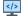

# Instruções Rápidas

## 1.  Crie uma Planilha Google

- Exemplo de nome: **Inventário CGTI**
- Adicione as seguintes colunas na linha 1:
    - `Numero Item`
    - `Setor`
    - `Especificacao`
    - `Quantidade`
    - `RP`
    - `Estado`
    - `Foto(Base64)`

## 2. &nbsp; Crie a pasta raiz no drive

#### Crie uma pasta no Drive como o nome: "Inventario" que será a pasta raiz.

✅ Agora as fotos vão ficar organizadas assim no Google Drive

```css
📂 Inventario (pasta raiz)
 ┣ 📂 Laboratorio CVT
 ┃   ┣ etiqueta_123.jpg
 ┃   ┗ etiqueta_456.jpg
 ┣ 📂 Biblioteca
 ┃   ┣ etiqueta_789.jpg
 ┗ 📂 Secretaria Academica
     ┗ etiqueta_999.jpg
```


## 3. 📂 Configure o Google Apps Script

#### 1. No menu da planilha, acesse **Extensões > Apps Script**.
#### 2. Cole o código abaixo no editor:

```javascript
function doPost(e) {
  try {
    const data = JSON.parse(e.postData.contents);

    const rootFolder = DriveApp.getFolderById("COLE_AQUI_ID_DA_PASTA"); // pasta raiz do inventário
    const ss = SpreadsheetApp.getActiveSpreadsheet();
    const sheet = ss.getSheetByName("Página1");

    // procura ou cria subpasta do setor
    let setorFolder;
    const folders = rootFolder.getFoldersByName(data.setor);
    if (folders.hasNext()) {
      setorFolder = folders.next();
    } else {
      setorFolder = rootFolder.createFolder(data.setor);
    }

    // processa unidades
    data.unidades.forEach(unidade => {
      let fotoLinks = [];

      unidade.fotos.forEach(fotoBase64 => {
        const contentType = fotoBase64.match(/^data:(.*);base64,/)[1];
        const bytes = Utilities.base64Decode(fotoBase64.split(",")[1]);
        const blob = Utilities.newBlob(bytes, contentType, `etiqueta_${unidade.rp}.jpg`);

        const file = setorFolder.createFile(blob);
        file.setSharing(DriveApp.Access.ANYONE_WITH_LINK, DriveApp.Permission.VIEW);

        fotoLinks.push(file.getUrl());
      });

      // salva linha na planilha
      sheet.appendRow([
        data.numItem,
        data.setor,
        data.especificacao,
        data.quantidade,
        unidade.rp,
        unidade.estado,
        fotoLinks.join(", ")
      ]);
    });

    return ContentService.createTextOutput(JSON.stringify({status: "ok"}))
      .setMimeType(ContentService.MimeType.JSON);

  } catch (err) {
    return ContentService.createTextOutput(JSON.stringify({status: "erro", msg: err}))
      .setMimeType(ContentService.MimeType.JSON);
  }
}
```

#### 3. Implemente como **Aplicativo da Web**:
- Selecione "Qualquer pessoa com o link" para acesso.
- Copie a URL do Web App gerado.

## 4. &nbsp; Configure o HTML

- No seu HTML, substitua o valor de `GOOGLE_APPS_SCRIPT_URL` pela URL publicada do seu Web App.

---

Pronto! Siga esses passos para integrar sua planilha ao sistema.